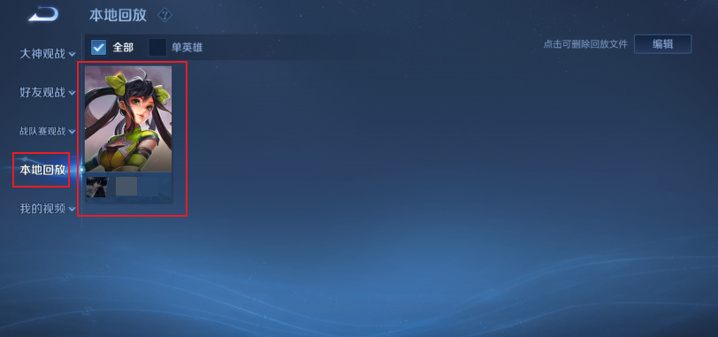
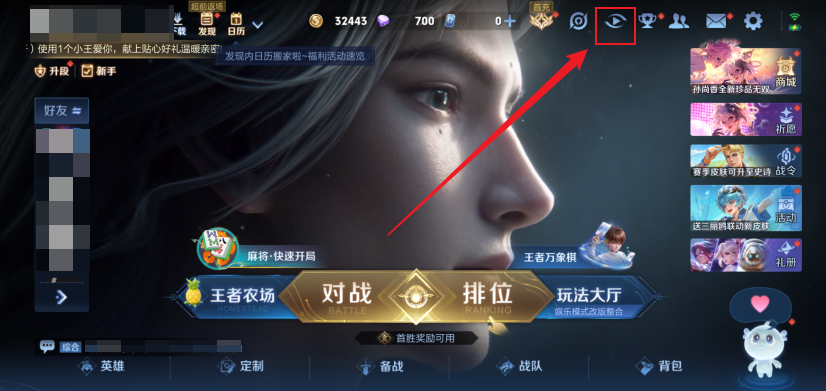
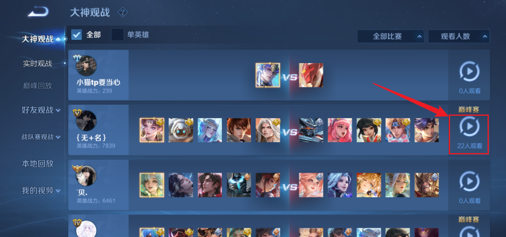
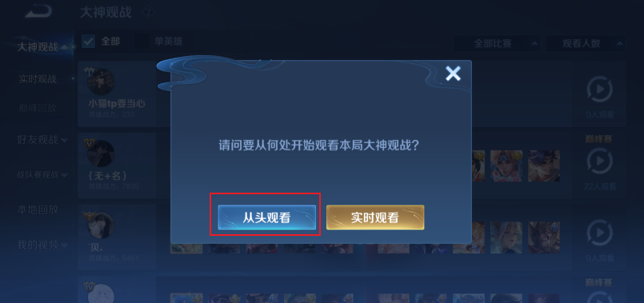
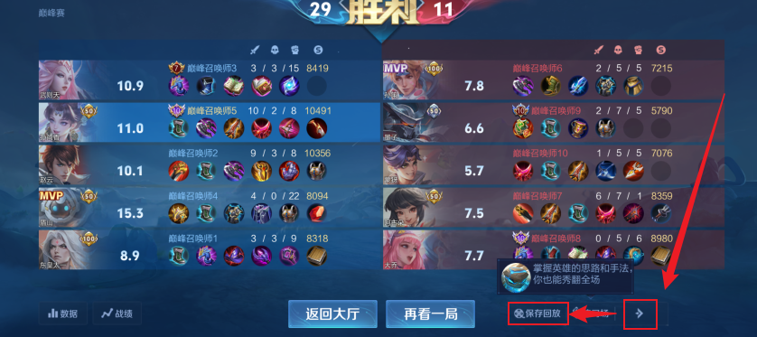
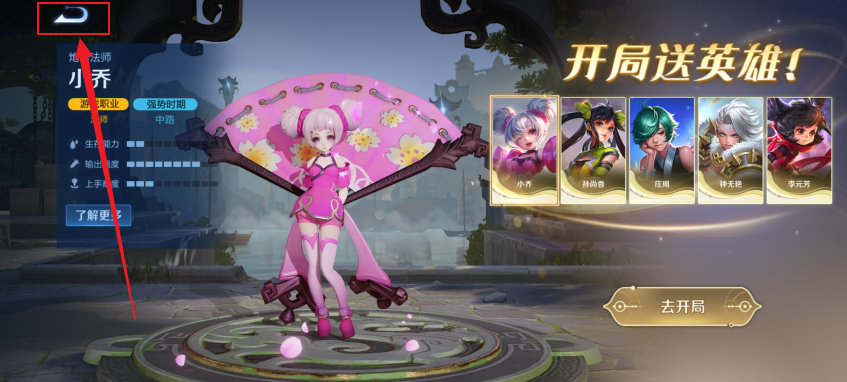
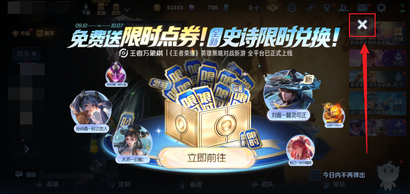
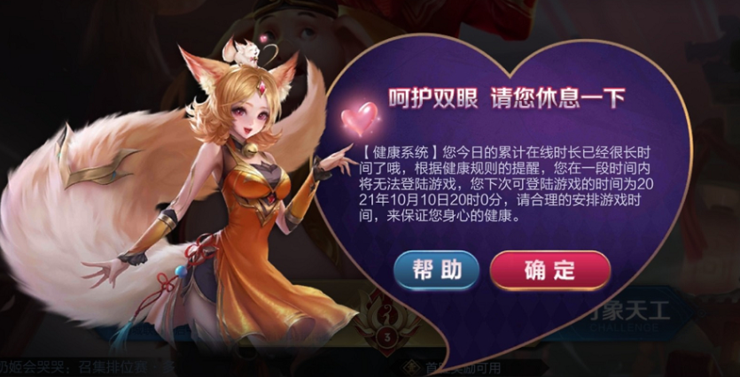

# 王者荣耀支持

## 自动化流程

1. 重启游戏，等待“开始游戏”按钮出现
2. 点击“开始游戏”
3. 关闭可能出现的广告、通知、推广弹窗。直到完全进入大厅（通过比对“回放”按钮是否正确）
4. 点击“回放”按钮进入回放界面，逐步点击“本地回放”、第一个回放卡片、“确认”，以进入回放
5. 开启 Perfetto 录制，时长为 `config.run_duration + 120s`
6. 等待 logcat 的 `ApolloHelperCNV5 MSDK OnStatusChangeEvent, currentStatus: 3,statusRet.ThirdCode = 3` 事件作为游戏对局时间轴的 0s 节点
7. 应用 FPSGO 参数
8. 等待到时间轴 30s，作为此次 run 分析的开始时刻（不从0s开始，因为刚开局不稳定）
9. 进行早停检测。如果不必早停，就等待到 `config.run_duration` 或 perfetto 录制结束
10. 到达录制时间，停止录制进程
11. 退出游戏

## 注意事项

### 确保至少存在一个游戏回放

> 在运行之前，必须在回放系统中有对局记录！

游戏调优将使用第一个回放。在回放菜单中，确保“本地回放”的第一个项目为想要调优的对局（可以根据实际需求使用不同段位、不同强度的对局）

如果没有，可以根据以下步骤创建回放：

1. 进行普通的匹配或者排位对局，调优框架将以此对局作为调优基准。也可以从回放系统中实时观战其他玩家的对局：

2. 等待游戏结束，会进入结算和数据画面。此时点击右下角小箭头展开，点击“保存回放”即可将回放保存。其他非观战的对局也是同样的方法保存

> 额外注意，游戏每次更新都会清空“本地回放”所有已有的回放！

### 进游戏时的弹窗

目前仅支持检测“U形箭头”和“X按钮”关闭。游戏可能在未来更新会出现其他异形按钮，需要进行适配。

值得注意的是，当天如果本账号游玩时间过长，在进入大厅时会跳出强制休息15分钟弹窗。这已经自动通过 run 的指数退避解决（退避保证能横跨 15 分钟）

### 模拟点击的设备兼容性

自动化流程中，不同分辨率的设备之间无法互相兼容，直接运行会导致点击错误或无法识别：

- 图像对比是逐像素对比，不同分辨率的图标和模板图标无法对应，造成比对失败
- 其他固定点位触控也强依赖设备分辨率，否则会造成点击位置错误